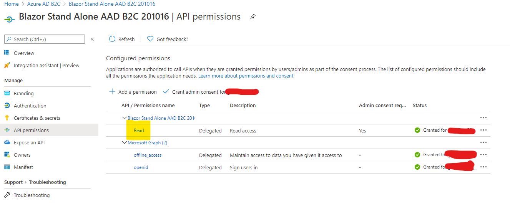

C# Solution with a Blazor WASM client app connected to Azure AD B2C for user to login and obtain JWT,
and a Function App with a sample Http Trigger that is secured using the JWT.

For this to work you will need to have CORS enabled for the Azur Function API, see links below.

This sample solution was put together using Visual Studio 2019 16.7.6 in October 2020, and is based on information from the following links:
- [Secure an ASP.NET Core Blazor WebAssembly standalone app with Azure Active Directory B2C](https://docs.microsoft.com/en-us/aspnet/core/blazor/security/webassembly/standalone-with-azure-active-directory-b2c?view=aspnetcore-3.1)
- [Access token scopes](https://docs.microsoft.com/en-us/aspnet/core/blazor/security/webassembly/standalone-with-azure-active-directory-b2c?view=aspnetcore-3.1#access-token-scopes)
- [Attach tokens to outgoing requests](https://docs.microsoft.com/en-us/aspnet/core/blazor/security/webassembly/additional-scenarios?view=aspnetcore-3.1#attach-tokens-to-outgoing-requests)
- Thanks to:
  - [Damien Bowden - SECURING AZURE FUNCTIONS USING AZURE AD JWT BEARER TOKEN AUTHENTICATION FOR USER ACCESS TOKENS](https://damienbod.com/2020/09/24/securing-azure-functions-using-azure-ad-jwt-bearer-token-authentication-for-user-access-tokens/)
  - [Christos Matskas - Create an Azure AD protected API that calls into Cosmos DB with Azure Functions and .NET Core 3.1](https://cmatskas.com/create-an-azure-ad-protected-api-that-calls-into-cosmosdb-with-azure-functions-and-net-core-3-1/)
  - [Boris Wilhelms - Secure Azure Functions with JWT access tokens](https://blog.wille-zone.de/post/secure-azure-functions-with-jwt-token/#secure-azure-functions-with-jwt-access-tokens)
- Azure Functions CORS, see [Configure CORS for Azure Functions Local Host](https://stackoverflow.com/questions/42378987/configure-cors-for-azure-functions-local-host) and [Handling CORS Policy In Azure Functions](https://www.c-sharpcorner.com/article/handling-cors-in-azure-function/)

# Prerequisites
- Visual Studio 2019 16.7.6 with workloads for asp.net and azure and blazor development
- Access to Azure, and from there you need to create an 'Azure Active Directory B2C' or sometimes called a 'B2C Tenant' with a setup as described in [Secure an ASP.NET Core Blazor WebAssembly standalone app with Azure Active Directory B2C](https://docs.microsoft.com/en-us/aspnet/core/blazor/security/webassembly/standalone-with-azure-active-directory-b2c?view=aspnetcore-3.1),
- including a API Permission / scope name 'Read', see below:
- 
- Create appsettings.Development.json and local.settings.json files as described in the Projects section below.

Once these steps are done you should be able to set both projects as Startup projects and start debugging.

# Projects

## BlazorWasm - Blazor Wasm project
- create a new file named appsettings.Development.json in the same folder as appsettings.json and set the values based on appsettings.json:
  - Authority e.g. "https://mytestadb2c.b2clogin.com/mytestadb2c.onmicrosoft.com/B2C_1_susi", template "https://{domain name prefix}.b2clogin.com/{domain name prefix}.onmicrosoft.com/{policy/userflow that was used to get the token}"
  - ClientId e.g. "0c109a26-9e4c-4e20-a1a4-676f34bad4e7" Application (client) ID fof the AD B2C Application you configured
  - ValidateAuthority false
  - Scope e.g. "https://mytestadb2c.onmicrosoft.com/0c109a26-9e4c-4e20-a1a4-676f34bad4e7/Read", fully qualified API / Permission name
  - SecureWebApiEndpoint e.g. http://localhost:7071, base url of the Function with the web api
- should be started with http://localhost:46205

## FunctionApp1 - Function App Project with an HttpTrigger as a web api
- create a file 'local.settings.json' and with the following values:
{
  "IsEncrypted": false,
  "Values": {
    "AzureWebJobsStorage": "UseDevelopmentStorage=true",
    "FUNCTIONS_WORKER_RUNTIME": "dotnet"
  },
  "Host": {
    "CORS": "*"
  },
  "AzureAd": {
    "Instance": "<e.g. https://mytestadb2c.b2clogin.com>", //template "https://{domain name prefix}.b2clogin.com"
    "TenantId": "<e.g. ee02066e-cda3-1234-98fc-e6a69f123f0c", //the Directory Directory (tenant) ID / Tenant Id  obtained from the Azure portal
    "ClientId": "<e.g. 0c109a26-9e4c-4e20-a1a4-676f34bad4e7", //Application (client) ID obtained from the Azure portal
    "UserFlow": "B2C_1_susi" //User Flow / Policy used to obtain the token/login
  }
}
- should be started with endpoint  http://localhost:7071/api/GetName

